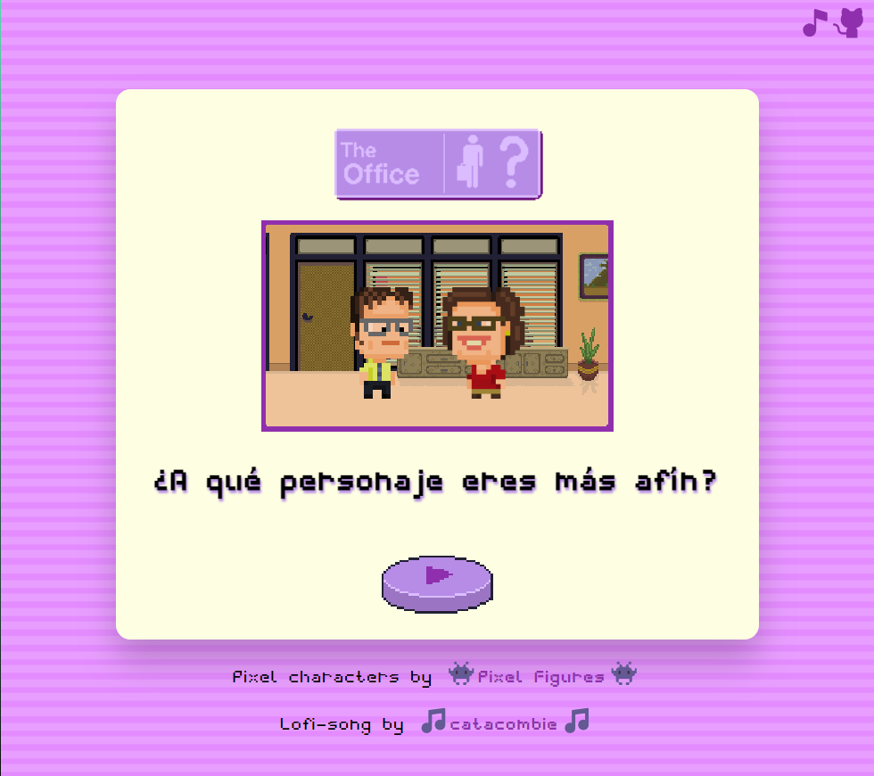
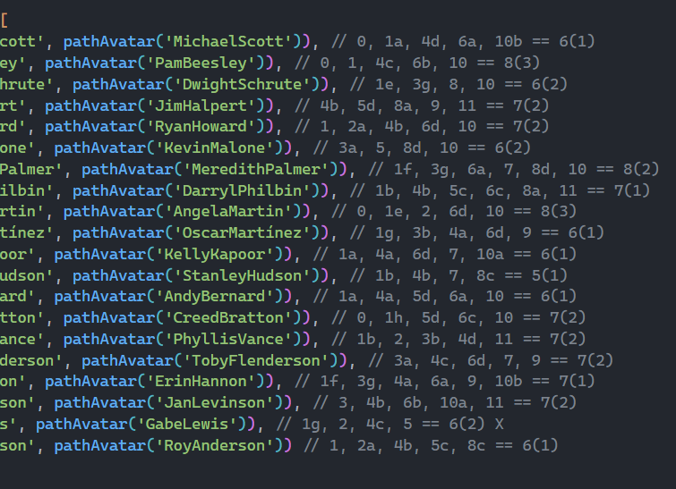

# 🧑‍💼 Test de afinidad de _The Office_

_Una app para revelar con qué personaje de la serie 'The Office' tienes más afinidad._

## 📋 Requisitos
* Habrá una lista con varios personajes de la serie, los cuales contarán con las siguientes propiedades: _name_ (nombre del personaje), _avatar_ (ruta a la imagen de su avatar en pixel art) y _affinity_ (propiedad que se incrementará en función de las opciones que se escojan a lo largo del test).
* Se dispondrá de un botón con el que se podrá reproducir o pausar una canción de fondo y cuyo contexto se compartirá a lo largo de las diferentes secciones que conforman la app (HomePage, QuizzPage, ResultPage). Es decir, una sola instancia de audio que se compartirá a lo largo de la experiencia por la web.
* Mantener una cierta estética pixel art - minimalista con la intención de evocar a la experiencia de un pequeño juego retro (humilde y con sus muchas excepciones 😅).

## 🛠️ Características a arreglar / mejorar
* Se podrían añadir más preguntas y más opciones de respuesta para lograr una mayor precisión para calcular el personaje más afín a los usuarios de la app.
* Mejorar el sistema de imports de imágenes, el cual se realizó de forma manual para poder desplegar la web sin problemas con sus rutas de acceso (lo que no es muy eficiente ni lo hace mantenible a largo plazo).
* Revisar el sistema de afinidad inicialmente propuesto por otro que logre una mayor equidad en función de si se tratan de respuestas más específicas del propio personaje o más genéricas, etc. (Cualquier sistema de puntuación mejoraría el inicialmente propuesto porque... \*tos\* 👀)

## ✒️ Autorías ajenas
* Avatares de los personajes en pixel art por <a href='https://pixelfigures.tumblr.com' target='_blank' rel='noreferrer'>Pixel Figures</a>.
* Versión lo-fi del tema principal de The Office por <a href='https://soundcloud.com/catacombie' target='_blank' rel='noreferrer'>catacombie</a>.

## 📎Lo utilizado

